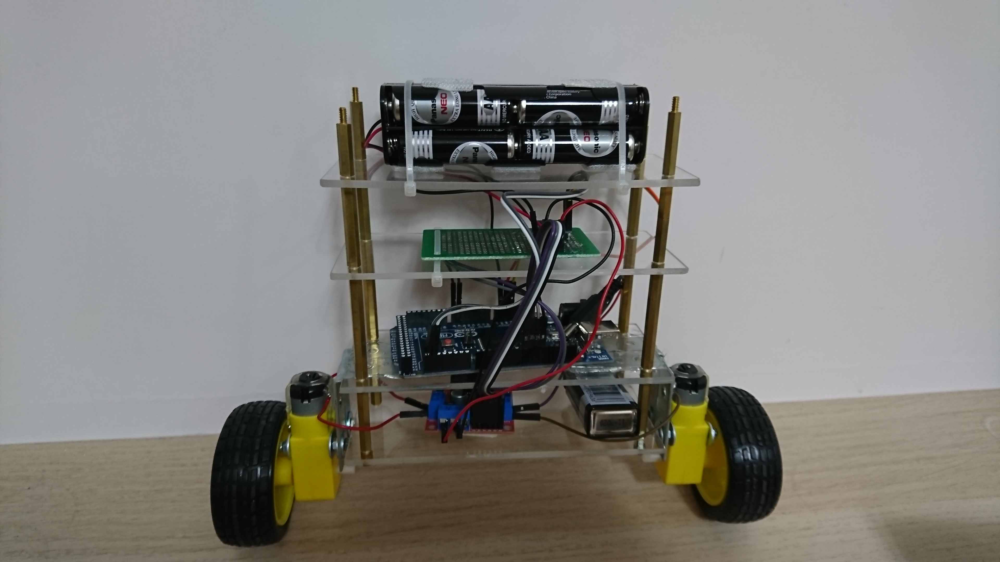

# Two-wheel Self-balancing Car
This is an Arduino program developed for two-wheel self-balacing car. The porgram only do 2 things, using complementary filter to manipulate data collected by gyroscope MPU6050, and using PID controller to drive DC motor.

Most of the code is developed by mr_fid, who published a tutorial of "YET ANOTHER BALANCING ROBOT!" in instructable (https://www.instructables.com/id/Yet-Another-Balancing-Robot/).

Click the car to watch the demo video!

